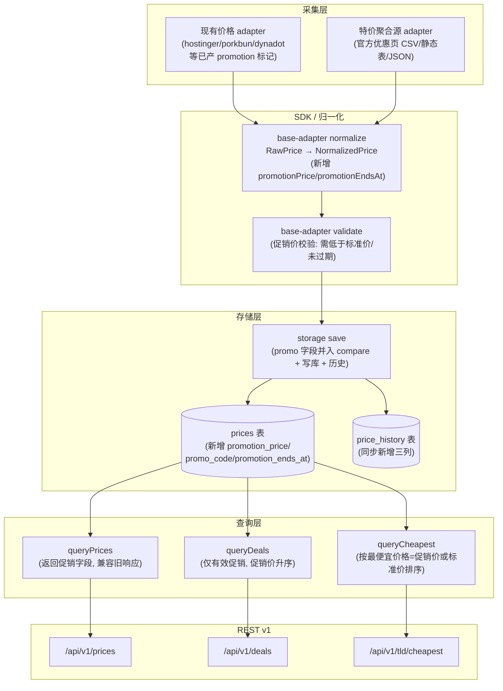

# 特价与优惠券（deals-and-coupons）

Feature Name: deals-and-coupons
Updated: 2026-10-03

## Description

为 TLDbi 域名比价站补充「促销价 + 优惠码」数据维度。当前 `RawPrice`/`NormalizedPrice` 已有 `promotion`(bool) 与 `promoCode` 字段，但 (1) 无促销价数值字段，(2) 存储层只落库 register/renew/transfer/currency，促销信息被丢弃，(3) DB `prices` 表无促销列，(4) 查询层未暴露促销，「最便宜」仅按标准注册价。

本特性补齐整条链路：数据模型 → 存储 → 采集（现有源促销落库 + 新增特价聚合源）→ 查询语义（有促销取促销价，无则标准价）→ API。

## Architecture



**说明**：促销价不是独立表，而是复用 `prices` 的 `(registrar_id, tld_id)` 唯一键，避免 "有促销无标准价" 的孤立数据。聚合源与现有 adapter 同走归一化与存储管线，仅数据来源与解析不同。

## Components and Interfaces

### 1. SDK 类型扩展（`packages/adapter-sdk/types.ts`）

- `RawPrice` 新增可选字段：
  - `promotionPrice?: number | string | null`
  - `promotionEndsAt?: string | null`（ISO 8601）
- `NormalizedPrice` 新增可选字段（其余字段不变，向后兼容）：
  - `promotionPrice: number | null`
  - `promotionEndsAt: string | null`

### 2. base-adapter normalize（`packages/adapter-sdk/base-adapter.ts`）

在 `normalize()` 中把 `raw.promotionPrice`、`raw.promotionEndsAt` 透传到 `NormalizedPrice`；沿用 `parsePriceString` 处理价签字符串。不改变既有字段。

### 3. base-adapter validate（`packages/adapter-sdk/base-adapter.ts` 或 `packages/adapter-sdk/validation.ts`）

- 促销价规则：
  - IF `promotionPrice != null` AND `promotionPrice >= registerPrice`（且两者都非空）→ 该列打 warning `promotion-not-below-standard`（storage 层据此清空促销价，但记录日志）。
  - IF `promotionEndsAt < now()` → 视为过期，返回时按过期处理，不强制采集阶段丢弃。
- 不动既有的 negative-price / currency-mismatch 等既有校验码。

### 4. Storage（`packages/storage/index.ts` + `lib/db/schema.ts`）

- `prices` 表新增列（迁移加列，幂等）：
  - `promotion_price numeric(10,2)`（空=无促销）
  - `promo_code text`（空=无优惠码）
  - `promotion_ends_at timestamptz`（空=未知/长期）
- `price_history` 表新增同样的三列。
- `save()` 变更：
  - compare 把 promotion_price / promo_code / promotion_ends_at 纳入；三者都无变化才 `skipped++`。
  - 写入时若 `promotionPrice >= registerPrice` 且两者非空，则 promotion_price 存 null 并 `ctx.log("warn", ...)`。
  - update/insert 同时写促销三列；`priceHistory` 同样记录。
- `createDryRunSink` 的 compare 同步纳入促销三列比较（保持干跑统计一致）。

### 5. 特价聚合源 adapter（`adapters/` 新概念）

新增聚合源适配器目录/约定，复用同一 `defineAdapter` 契约，但 `slug` 复用已有注册商（促销合并到该注册商），`sourceUrl` 指向聚合源页。参考现有 `breadth-scan.ts` 的多源批扫结构。

- 每个聚合源声明：来源域名、`strategies`（CSV/静态 HTML/JSON）、解析该源「注册商→后缀→促销价/优惠码」。
- 命中注册商用其 slug 写入 `prices` 促销列；未命中入库的注册商域名写成源级白名单日志（不新开注册商，除非人工核准）。

**第一期实现的聚合源候选**（公开、低频率、结构清晰）：
- 各注册商「官网优惠/促销页」（如 registry 促销页常以静态表/公开 JSON 输出）。
- 公开会员优惠清单 CSV（规范行：registrar,tld,promo_code,promotion_price,ends）。

**反爬与合规**：遵循 robots.txt 与 ToS；第三方聚合站若 403/Cloudflare 依「实用主义」降频或跳过；只采公开不登录可见的优惠码。

### 6. 查询服务（`services/prices/index.ts`）

- `queryPrices`：select 增加 promotion_price/promo_code/promotion_ends_at，返回对象新增对应字段；对既有响应仅为「增量字段」，保持旧字段顺序与型别（向后兼容）。
- 新增 `queryDeals(filter: { registrar?, tld?, onlyActive?: boolean, limit? })`：
  - 过滤 `prices.promotion_price IS NOT NULL`；
  - `onlyActive` 默认 true 时加 `(promotion_ends_at IS NULL OR promotion_ends_at > now())`；
  - 按促销价升序，返回 registrar/tld/registerPrice/promotionPrice/promoCode/promotionEndsAt/currency/sourceUrl。
- 新增 `queryCheapest(tld)`：
  - 对该后缀在 active 注册商中按「最便宜价格」= `CASE WHEN promotion_price IS NOT NULL THEN promotion_price ELSE register_price END` 升序；
  - default 过滤 `is_active=true`，带出 registar/register/renew/transfer/promotion/ends/currency。

### 7. REST API

- 扩展 `app/api/v1/prices/route.ts`：透传促销字段；新增可选 `deals=true` 时走 `queryDeals`。
- 新增 `app/api/v1/deals/route.ts`：GET，参数 `tld` / `registrar` / `limit`，返回有效促销列表与总量。
- 新增 `app/api/v1/tld/[tld]/cheapest/route.ts`：GET，返回该后缀最便宜排名（前端 TLD 详情打底）。
- 每个新路由复用 `withFallback`，无 DB 时返回 seed 促销（可先为空 + 不打空壳）。

## Data Models

### prices 表新增列（迁移脚本，幂等 `ADD COLUMN IF NOT EXISTS`）

| 列 | 类型 | 约束/语义 |
|----|------|-----------|
| `promotion_price` | numeric(10,2) | 空=无促销；须 < register_price |
| `promo_code` | text | 空=无优惠码；公开来源字符串 |
| `promotion_ends_at` | timestamptz | 空=长期/未知；早于 now() 视为过期 |

### 归一化价格新字段

```
NormalizedPrice.promotionPrice: number | null
NormalizedPrice.promotionEndsAt: string | null
RawPrice.promotionPrice?: number | string | null
RawPrice.promotionEndsAt?: string | null
```

### 查询返回扩展（queryPrices / queryDeals / queryCheapest）

各返回对象追加：
```
promotionPrice: number | null
promoCode: string | null
promotionEndsAt: string | null      // 仅 deals/cheapest 需要
effectivePrice?: number | null      // 仅 cheapest：CASE 表达式结果
```

## Correctness Properties

- **唯一键不变**：促销三列挂在 `prices(registrar_id, tld_id)` 主键上，不存在独立促销行 → `UNIQUE(registrar_id, tld_id)` 覆盖。
- **促销价 < 标准价**：`promotion_price` 仅当 `< register_price` 才可持久化，否则存 null 并告警（防脏数据/防把涨价当特价）。
- **过期不可见**：`queryDeals` 默认只返回 `promotion_ends_at IS NULL OR promotion_ends_at > now()`。
- **最便宜口径单一**：`effectivePrice = COALESCE(promotion_price, register_price)`；标准价缺失时退化为既有行为。
- **向后兼容**：旧字段 register/renew/transfer/currency 的位置与类型不变；新字段仅追加。
- **幂等落库**：促销无变化不写库也不写历史（与标准价 compare 一致）。

## Error Handling

| 场景 | 行为 |
|------|------|
| 聚合源 HTTP 失败达重试上限 | 标记该源失败、跳过本轮，`crawl_logs` 记录，不阻塞其他源 |
| 聚合来源无法归属已收录注册商 | 写入源白名单日志，不自动建注册商 |
| 促销价 ≥ 标准价 | storage 落库时置 null + warn 日志 |
| 促销已过期 | queryDeals 默认过滤；采集不阻断，保留数据待清理 |
| 第三方优惠站反爬(403/Cloudflare) | 依配置降频或跳过，标记 sourceNotCrawlable |
| DB 不可用 | `withFallback` 回退 seed（促销字段可为空）|

## Test Strategy

- **SDK 单测**：normalize 透传促销字段；validate 对 `promotionPrice >= registerPrice` 报 warning、对未来截止时间不报错。
- **Storage 单测**：新字段 compare 正确（促销变化判定为 update/skipped）；促销价低于标准价才落库；历史正确记录。
- **迁移测试**：对既有 prices 行 `ADD COLUMN IF NOT EXISTS` 后既有标准价不变、促销列为 NULL。
- **回归**：`scripts/test-adapter.ts <slug>` 对 hostinger/porkbun/dynadot 保持通过；`queryPrices` 旧响应仍含 register/renew/transfer。
- **查询集成**：构造一条促销记录，验证 `queryDeals`(onlyActive 真/假)、`queryCheapest` 排序（促销价优先于标准价）。
- **端到端**：跑 `npx tsx --env-file=.env.local scripts/test-adapter.ts <促销型slug>` 真实写库，实查 DB 促销列非空；`/api/v1/deals` 返回该记录。

## References

^1: (项目文件) - [packages/adapter-sdk/types.ts](../actual:/workspace/packages/adapter-sdk/types.ts) — 既有 RawPrice/NormalizedPrice，已含 promotion/promoCode，无促销价数值字段
^2: (项目文件) - [packages/adapter-sdk/base-adapter.ts](packages/adapter-sdk/base-adapter.ts) — normalize 透传 promotion/promoCode；validate 调 validatePrices
^3: (项目文件) - [packages/storage/index.ts](packages/storage/index.ts) — save 仅落 register/renew/transfer/currency，促销被丢弃
^4: (项目文件) - [lib/db/schema.ts](lib/db/schema.ts) — prices 表无促销列
^5: (项目文件) - [services/prices/index.ts](services/prices/index.ts) — queryPrices / queryStatistics，按标准注册价比较
^6: (项目文件) - [adapters/hostinger.ts](adapters/hostinger.ts) — 已计算 promotion 布尔标记但无促销价数值
^7: (项目文件) - [adapters/breadth-scan.ts](adapters/breadth-scan.ts) — 多源批扫结构，可参考做特价聚合源